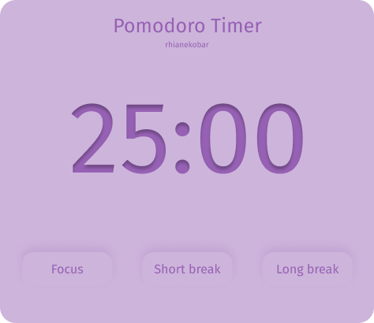
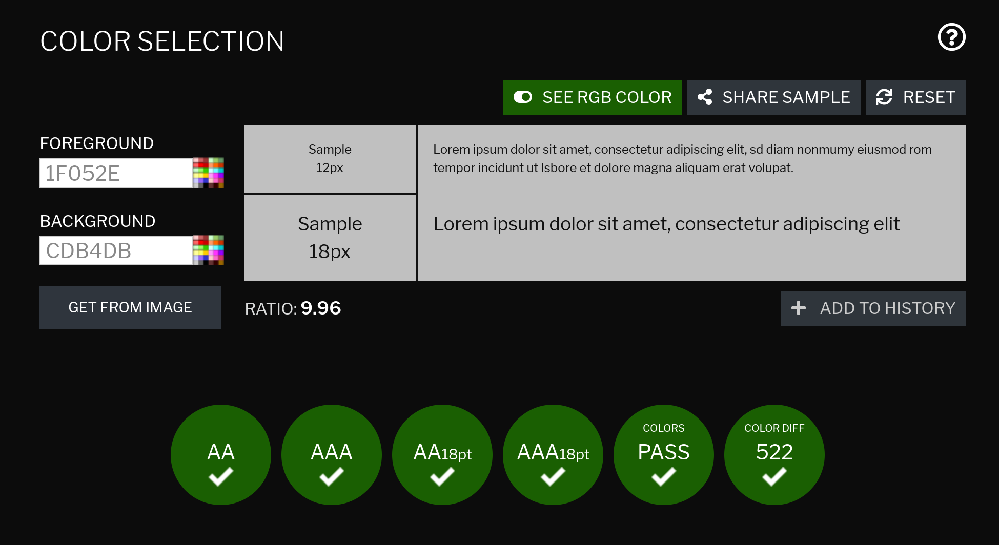

# Pomokobar

A pomodoro timer browser extension! Keep track of your work times and ensure you're taking enough breaks!

## Design

Design of the default timer with no buttons pressed

Design of the timer with focus button pressed

As a dev it's important to make the programmes we create and maintain accessible to all. I'm still learning how to do this but the first thing I did was choose a sans-serif font because they're easier to read and check the constrast of the colours I'd choosen.

The above images shows the result from checking the colours on [this contrast checker](https://contrastchecker.com/).

## Changes made along the way

- Decided to add a start/stop button. This allows the user to check the timer is correct before starting it.